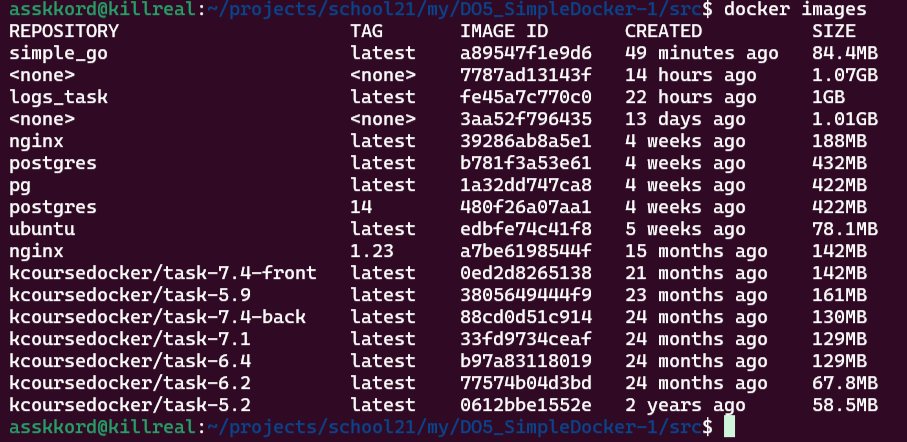
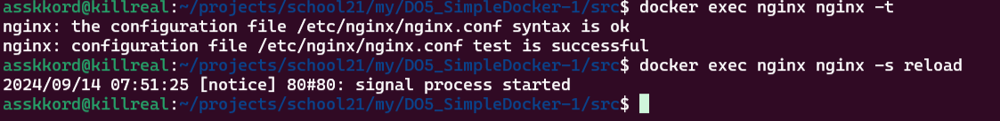

## Готовый докер

Загрузка образа nginx через команду `docker pull`

Проверка наличия образа через команду `docker images`

Запуск образа через комнаду `docker run`

Проверка наличия процесса через команду `docker ps`

Просмотр информации о контейнере через команду 
`docker inspect %container_id%`

Размер докер образа

Его IP

Замапленый порт

Остановка докер образа и проверка его остановки

Запуск образа с замапленными портами

Проверка работы сервера

Перезагрузка докер образа и проверка наличия процесса

## Операции с контейнером

Вывод содержимого файла nginx.conf

Создание файла nginx.conf и астройка в нем по пути /status отдачу страницы статуса сервера

Коприование nginx.conf внутрь докер образа, перезагрузка nginx, проверка статуса сервера

Экспорт докер контейнера в файл, остановка контейнера

Удаление докер образа и удаление остановленного контейнера

Импорт сохраненного контейнера, его запуск и проверка работоспособности

